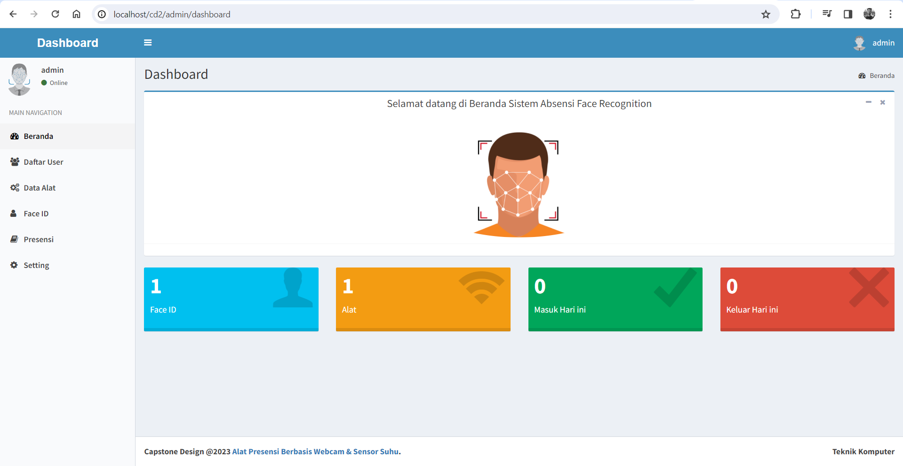

# Testing the attendance and body temperature checking website with a local server using XAMPP

  

  

<code></code>
<code></code>
<code></code>
<code></code>
<code></code>
<code></code>
<code></code>

## Steps
In testing this website with a local server, please follow these steps.
 Step 1: Download the 'cd2' folder from this repository.
 Step 2: Install XAMPP. (https://www.apachefriends.org/download.html)
 Step 3: Copy and paste the 'cd2' folder into C:\xampp\htdocs on your computer.
 Step 4: Run XAMPP, click 'start' for MySQL and Apache.
 Step 5: Launch PHPMyAdmin by clicking 'admin' for MySQL in XAMPP.
 Step 6: Create a database named 'capstonedesign2'.
 Step 7: Import database 'db.sql' from 'cd2' folder.
 Step 8: Open a browser and type 'localhost/cd2' (without quotation marks).
 Step 9: The website is successfully running, please log in with the username 'admin' and password 'admin' (without quotation marks).
